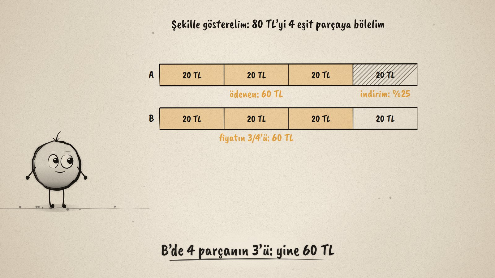
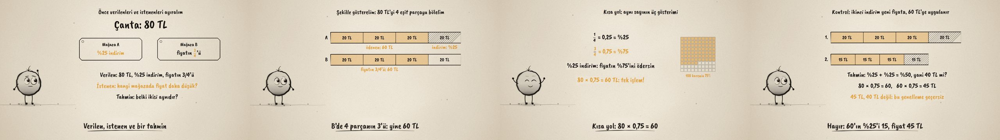

# Hangisi Ucuz? · Fractions, Decimals and Percents

**▶ Tarayıcıda izleyin / Watch in the browser:** https://hakanatas.github.io/hangisi-ucuz/ 
**⬇ MP4 + altyazılar / MP4 + subtitles:** [Releases](https://github.com/hakanatas/hangisi-ucuz/releases) 
**✎ Kullanılan istem / The prompt behind it:** [PROMPT.md](PROMPT.md) 
**🎞 Bütün filmler / All films:** [Nokta'nın Filmleri](https://hakanatas.github.io/nokta-filmleri/?sinif=6)

> **TR —** 6. sınıf matematik "Sayılar ve Nicelikler" temasındaki MAT.6.1.7 öğrenme çıktısı için hazırlanmış, tamamen JavaScript ile çizilen 92 saniyelik mürekkep animasyonu. 80 TL'lik bir çanta: mağaza A %25 indirim yapıyor, mağaza B fiyatın 3/4'ünü istiyor. Problem baştan sona bir çözüm döngüsüyle ele alınıyor: verilenler ve istenen ayrılıyor, bir tahmin yapılıyor ("belki ikisi aynıdır"), şerit modelle gösteriliyor, işlemle çözülüp kontrol ediliyor (ikisi de 60 TL). Sonra kısa yol: 1/4 = 0,25 = %25 ve 3/4 = 0,75 = %75 (100 karelik tabloda), yani %25 indirim = fiyat × 0,75. Son olarak cazip bir genelleme sınanıyor: iki kez %25 indirim %50 indirim midir? Şerit model ve işlem 45 TL veriyor, 40 değil; genelleme geçersiz, strateji düzeltiliyor. Altyazılar Türkçe, İngilizce ya da ikisi birlikte seçilebilir.

A 92-second ink animation for **6th-grade maths**, drawn entirely with JavaScript on an HTML5 canvas. Nokta, the ink character from [The Learning Ink](https://github.com/hakanatas/the-learning-ink), is the guide again. This outcome is about the problem-solving process itself (sub-items a–h), so the film follows one problem through every step, including a shortcut and a generalisation that has to be checked and rejected.

## Learning outcome

MEB, Türkiye Yüzyılı Maarif Modeli, Ortaokul Matematik, 6th grade, "Sayılar ve Nicelikler" theme:

**MAT.6.1.7. Gerçek yaşam durumlarında karşılaşılan kesir, ondalık ve yüzde gösterimleri ile ilgili dört işlem gerektiren problemleri çözebilme**
- a) Kesir, ondalık ve yüzde gösterimleri ile ilgili dört işlem problemlerinde sayı ve işlem bileşenlerini belirler.
- b) Kesir, ondalık ve yüzde gösterimleri ile ilgili dört işlem problemlerinde verilenler ile istenenlerin gerektirdiği işlemler arasındaki ilişkiyi belirler.
- c) Kesir, ondalık ve yüzde gösterimleri ile ilgili dört işlem problemlerinde problem bağlamına uygun temsilleri (şekil, tablo, diyagram gibi) kullanır.
- ç) Kullanılan temsil üzerinden problemi kendi ifadeleri ile açıklar.
- d) Problemlerin sonucuna ilişkin tahminde bulunur ve işlemleri gerçekleştirmek için stratejiler geliştirir.
- e) Stratejileri işe koşarak problemleri çözer.
- f) Çözüm yollarını kontrol eder ve çözüme ulaştırmayan stratejiyi değiştirir.
- g) Problemlerin çözümü için kullandığı veya geliştirdiği stratejileri gözden geçirerek kısa yolları değerlendirir.
- ğ) Kullandığı strateji veya stratejileri farklı problemlerin çözümlerine geneller.
- h) Genellemenin geçerliliğini değerlendirir.

## Scenes

| # | Time | Scene | What happens | Outcome |
|---|---|---|---|---|
| 1 | 0–10 s | İki mağaza | An 80 TL bag: 25% off in shop A, 3/4 of the price in shop B. | a |
| 2 | 10–30 s | Verilen, istenen, şekil | Given, asked and a guess; a bar model of four 20 TL parts shows 60 TL in both shops. | a, b, c, ç, d |
| 3 | 30–46 s | Çöz ve kontrol et | 80 − 80 × 25/100 = 60 and 80 × 3/4 = 60: the guess was right; 25% off means paying 3/4. | b, e, f |
| 4 | 46–60 s | Kısa yol | 1/4 = 0.25 = 25%, 3/4 = 0.75 = 75% on a 100-square grid; 80 × 0.75 = 60 in one step. | c, g |
| 5 | 60–80 s | Genelleme geçerli mi? | Is 25% off twice the same as 50% off? The bars and 60 × 0.75 = 45 say no; each discount applies to the current price. | f, ğ, h |
| 6 | 80–92 s | Aklında kalsın | Given and asked, a picture, guess, solve, check; 25% off = price × 0.75. | d, g |

## Running it

- **Preview:** double-click `index.html` (it works offline).
- **MP4:** run `npm install` once, then `npm run export -- --format=horizontal --captions=tr`.
- **Subtitles and narration:** `npm run srt` writes `out/captions_*.srt` and `narration_notes.txt`.
- **Editing:**
  - Caption text, timings and narration notes: `captions.js`
  - Everything on screen is drawn by `LI.world(t)` in `scenes/scene1.js` (the offers, the bar models, the working, the grid, the two discounts); the other scenes only set the camera.
  - The bar model, price tags, the 100-square grid, fractions and Nokta's poses: `src/draw/film.js`; layout for 16:9 and 9:16: `src/draw/kd.js`

It uses the same engine as The Learning Ink: `renderFrame(t)` as a pure function of time, seeded randomness, and frame-by-frame export.

## Lisans · License

**TR —** Bu film ve kodu [Creative Commons Atıf-GayriTicari 4.0 Uluslararası (CC BY-NC 4.0)](https://creativecommons.org/licenses/by-nc/4.0/deed.tr) lisansıyla paylaşılır. Ticari olmayan her amaçla (derste, okulda, eğitim materyalinde) kopyalayabilir, paylaşabilir ve değiştirebilirsiniz; ancak **kaynak göstermek zorunludur**: eser sahibinin adı ve bu deponun bağlantısı belirtilmeden kullanılamaz. Ticari kullanım (satış, ücretli ürün ya da yayın) için izin alınmalıdır.

**EN —** This film and its code are licensed under [Creative Commons Attribution-NonCommercial 4.0 International (CC BY-NC 4.0)](https://creativecommons.org/licenses/by-nc/4.0/). You may copy, share and adapt them for non-commercial purposes, but **attribution is required**: they may not be used without crediting the author and linking to this repository. Commercial use requires permission.

Atıf örneği / Required credit: *“Hangisi Ucuz?”, Hakan Ataş, Nokta'nın Filmleri — https://github.com/hakanatas/hangisi-ucuz — CC BY-NC 4.0*
